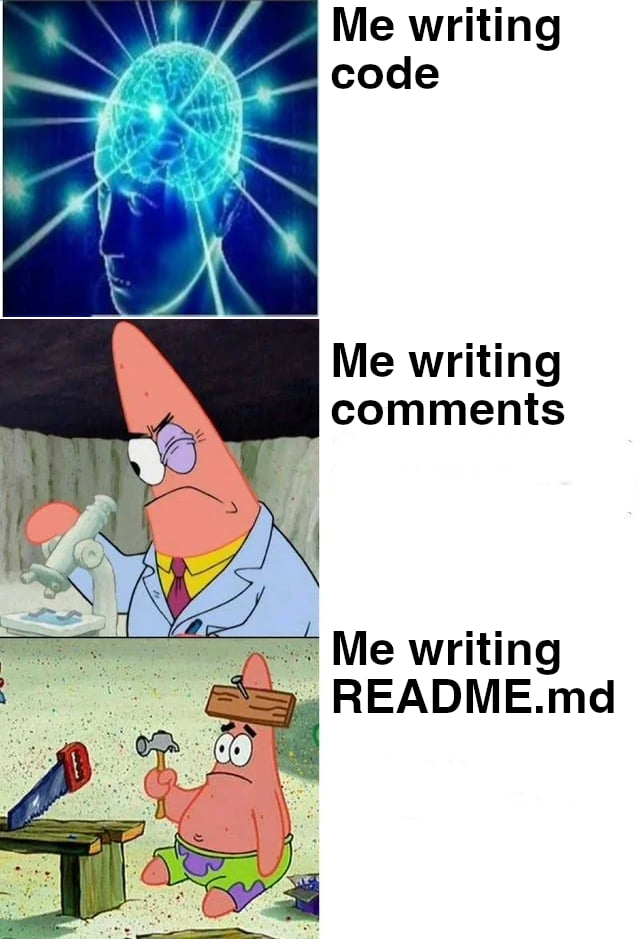

# Team voetbalonderzoek

Voor ieder analyseproject maken we een aparte repository (in het kort: repo) aan op Github
Dit is een omgeving in de cloud waar straks alle code gebackuped staat. 

> Geef de repo een naam; volg daarbij de KNVB afdeling onderzoek style guide (kleine letters, met uit-
zondering van afkortingen, met een koppelteken tussen woorden). 

Wanneer je een beschrijving (de-scription) toevoegt aan de repo, en de optie ‘add README’ aanvinkt, wordt de description automatisch
een README.txt bestand. Dit bestand wordt op de voorpagina van de repo weergegeven. 

> REGEL 2: Voeg aan elke repo een README.md toe. Hierin komt later de volledige
analyse te staan met alle stappen om de analyse te reproduceren

### 1.3 Creëer een RStudio project (local repo) en associeer met remote repo
De remote repo leeft! Nu maken we een RStudio project waarmee we deze repo associëren. Dit noemen
we de *local repo*. Dit doe je door door de URL van de GitHub repo te kopiëren (ik heb de KNVB-
2
voetbalmonitor repo als voorbeeld gebruikt, zie Figure 1).

maken we een aparte repository aan. De naam van deze repository voldoet aan de naamgevingsregels die we binnen het team gebruiken
De reposity bestaat altijd uit de volgende 

___

### Mappenstructuur
* repository-naam
  * data/  
  
  * code/  
  Deze map zouden al je code moeten in R- moeten bevatten.  
  Je kunt kiezen voor een paar grote scripts, of meerdere scripts die alleen specifieke acties uitvoeren.
  
  * results/  
  Deze map en submappen bevatten resultaten die door de code zijn geproduceerd, zoals figuren en tabellen, en andere bestanden.
  
  * output/  
  De bestanden binnen deze map zouden alle output van je project moeten bevatten.  
  Voor een typisch analyseproject zal dit het eindrapport zijn.  
  Als een figuur of ander bestand wordt gemaakt door het uitvoeren van code,  
  zou dit in een submap binnen /results moeten worden geplaatst.
  
  * docs/  
  Project documentatie
  
  * README.md

## KNVB voetbalonderzoek coding style

Een README is ontzettend belangrijk

Lorem ipsum dolor sit amet, consectetur adipiscing elit. Duis rutrum nisl interdum dui efficitur, 
non rutrum risus suscipit. Quisque vitae lacus at leo porttitor fringilla a ac dui. Proin et eros 
id elit tincidunt pretium eget sit amet nulla. Nullam a arcu dolor. Aliquam erat volutpat. Sed porttitor 
pellentesque pellentesque. Praesent consequat molestie erat, at congue ante lobortis at. Nunc tristique
eros sit amet lorem sagittis, ac condimentum lectus volutpat. Proin at molestie felis.

Curabitur vestibulum, tellus et rutrum convallis, ante lectus sodales dui, in malesuada ante arcu vel 
dolor. Sed ut mi eu lorem porttitor fringilla. Nunc quis nulla sed velit convallis rutrum. Proin gravida 
congue fermentum. Pellentesque commodo venenatis dolor vel lacinia. Vivamus in quam at nibh sagittis efficitur. 
Etiam commodo dapibus dignissim. Etiam mauris ante, lacinia quis velit ut, hendrerit tincidunt dolor. Fusce sollicitudin, 
mi at ultricies cursus, eros leo euismod enim, vitae maximus urna dui id massa. Nunc dictum dapibus elit nec molestie.
Donec ac arcu non eros consequat pulvinar non non velit. Donec diam elit, gravida vel lectus sit amet, consequat commodo
purus. Mauris ultrices est ut sapien cursus pretium. Quisque non nisl at nulla maximus placerat nec id magna. 
Morbi convallis, magna commodo convallis vehicula, urna lectus sollicitudin tortor, at vulputate mi est ut risus.

Donec imperdiet sollicitudin risus vel placerat. Proin ultrices neque nec ligula lobortis sollicitudin. 
Vestibulum non sapien ac elit dictum gravida ac sit amet augue. Sed nec elementum metus, nec tincidunt 
arcu. Etiam varius elit ac tincidunt semper. Maecenas rutrum.

 

